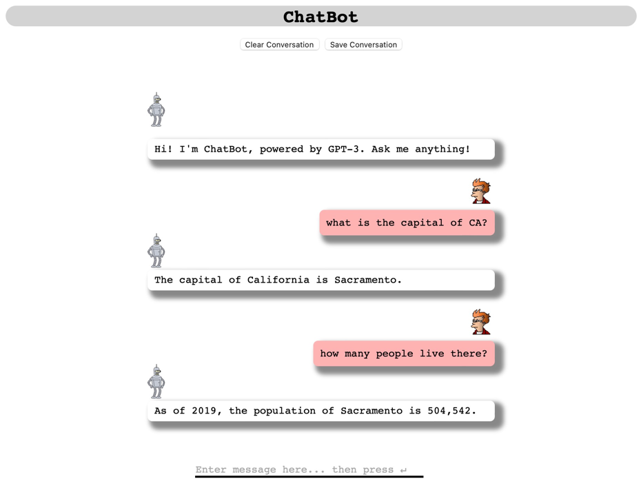

# flask-gpt
Prototype ChatGPT clone written in flask

Inspired by https://github.com/blessinvarkey/gpt3-flask-bot

Install requirements
```commandline
pip3 install -r requirements.txt 
```

Install gunicorn

```commandline
pip3 install gunicorn
```

Create `config.py` and add OpenAI API Key

```commandline
API_KEY = "sk-xxxxxx"
```

Run server using `flask-gpt-uWSGI-conf.py`

```commandline
gunicorn -c flask-gpt-uWSGI-conf.py app:app
```

If you want to build a container run 

```commandline
docker build -t flask-gpt . 
```

Then pass the OPENAI API key as an env variable

```commandline
docker run -p 443:443 -e OPENAI_API_KEY="sk-xxx" flask-gpt
```

The Server will run on the port according to the configuration the default is `http://0.0.0.0:443`



